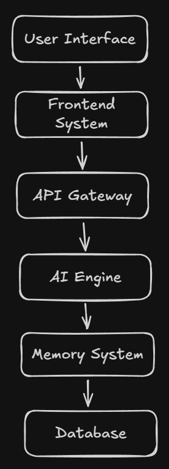

# ORION HELIX AI

Public showcase repository for the ORION HELIX AI ecosystem.

ORION HELIX AI is a next-generation autonomous AI infrastructure focused on multimodal reasoning, intelligent automation, scalable workflows, and future human-AI interaction systems.

---

# Vision

Building a scalable AI ecosystem capable of:

- Autonomous reasoning
- Voice interaction
- Vision intelligence
- AI agents
- Intelligent memory systems
- Workflow automation
- Future multimodal AI interaction

---

# Core Architecture

- AI Agent Infrastructure
- Backend API Systems
- Memory Engine
- Multimodal Processing
- Voice Systems
- Vision Intelligence
- Autonomous Workflow Engine

---

# Tech Stack

## Frontend
- React
- TailwindCSS

## Backend
- FastAPI
- Node.js

## AI Infrastructure
- PyTorch
- TensorFlow
- Transformers

## Database
- PostgreSQL
- Vector Databases

---

# Repository Purpose

This public repository showcases:
- architecture
- documentation
- roadmap
- UI previews
- engineering vision

Core source systems remain private during active development.

---

# Roadmap

- [ ] AI Agent Core
- [ ] Voice Intelligence
- [ ] Memory Architecture
- [ ] Vision System
- [ ] Autonomous Task Execution
- [ ] API Gateway
- [ ] Cloud Deployment

---

# Future Vision

Developed under SINGULARITY HORIZON.
